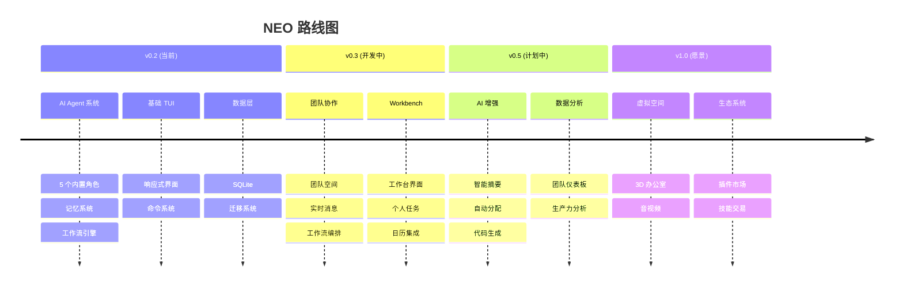

# NEO 特性清单

> 面向团队管理者和成员的智能终端工作台
> 最后更新: 2024年

---

## 📋 目录

1. [核心架构](#核心架构)
2. [已实现特性 (v0.2)](#已实现特性-v02)
3. [团队协作特性 (v0.3)](#团队协作特性-v03)
4. [计划特性 (v0.5)](#计划特性-v05)
5. [未来愿景 (v1.0)](#未来愿景-v10)
6. [发散思维 - 潜在功能](#发散思维---潜在功能)

---

## 核心架构

```
┌─────────────────────────────────────────────────────────────────┐
│                      NEO Workbench                     │
│  ┌──────────┐  ┌──────────┐  ┌──────────┐  ┌──────────┐         │
│  │ Dashboard│  │ Messages │  │  Tasks   │  │ Calendar │         │
│  └──────────┘  └──────────┘  └──────────┘  └──────────┘         │
├─────────────────────────────────────────────────────────────────┤
│                    Collaboration Engine                          │
│  ┌──────────┐  ┌──────────┐  ┌──────────┐  ┌──────────┐         │
│  │  Teams   │  │ Channels │  │Workflows │  │  Members │         │
│  └──────────┘  └──────────┘  └──────────┘  └──────────┘         │
├─────────────────────────────────────────────────────────────────┤
│                     AI Agent System                              │
│  ┌──────────┐  ┌──────────┐  ┌──────────┐  ┌──────────┐         │
│  │ Research │  │  Coder   │  │ Reviewer │  │Assistant │         │
│  └──────────┘  └──────────┘  └──────────┘  └──────────┘         │
├─────────────────────────────────────────────────────────────────┤
│                      Data & Integrations                         │
│  ┌──────────┐  ┌──────────┐  ┌──────────┐  ┌──────────┐         │
│  │  SQLite  │  │  GitHub  │  │ Calendar │  │  Email   │         │
│  └──────────┘  └──────────┘  └──────────┘  └──────────┘         │
└─────────────────────────────────────────────────────────────────┘
```

---

## 已实现特性 (v0.2)

### 🤖 AI Agent 系统

| 特性 | 状态 | 命令 | 描述 |
|------|------|------|------|
| 内置角色 | ✅ | `ai agent roles` | researcher/planner/coder/reviewer/synthesizer |
| 创建 Agent | ✅ | `ai agent create` | 创建自定义 AI 助手 |
| 编辑 Agent | ✅ | `ai agent edit` | 修改 Agent 配置 |
| 删除 Agent | ✅ | `ai agent remove` | 删除自定义 Agent |
| 导入/导出 | ✅ | `ai agent import/export` | 配置迁移 |
| 单 Agent 执行 | ✅ | `ai agent solo` | 单任务执行 |
| 多 Agent 编排 | ✅ | `ai agent run` | 多 Agent 协作 |
| Agent 会议 | ✅ | `ai agent meet` | 多 Agent 讨论 |
| 记忆系统 | ✅ | `ai agent memory` | 长期/情景/语义记忆 |
| 工作流 | ✅ | `ai agent workflow` | 可复用工作流模板 |

### 🧠 记忆系统

| 特性 | 状态 | 描述 |
|------|------|------|
| 长期记忆 | ✅ | 持久化存储到 SQLite |
| 情景记忆 | ✅ | 记录具体事件和上下文 |
| 语义记忆 | ✅ | 概念和知识关联 |
| 程序记忆 | ✅ | 技能执行记录 |
| 共享记忆池 | ✅ | 跨 Agent 共享 |
| 记忆蒸馏 | ✅ | AI 自动压缩旧记忆 |
| 记忆搜索 | ✅ | 关键词检索 |

### 🛠️ 技能与 MCP

| 特性 | 状态 | 描述 |
|------|------|------|
| 技能注册 | ✅ | 动态注册技能 |
| MCP 协议 | ✅ | 标准化接口 |
| 内置技能 | ✅ | Shell、文件、Git、HTTP |
| 技能执行 | ✅ | 安全沙箱执行 |
| 权限控制 | ✅ | 细粒度权限 |

### 💻 终端界面

| 特性 | 状态 | 快捷键 | 描述 |
|------|------|--------|------|
| 交互式 TUI | ✅ | `hyper tui` | 全屏终端界面 |
| 响应式布局 | ✅ | - | 自适应终端大小 |
| 多面板 | ✅ | Tab/1-6 | 主/侧/底部面板 |
| 消息面板 | ✅ | ↑↓ | 可滚动历史 |
| Command Palette | ✅ | Tab/Ctrl+P | 命令快速启动 |
| 自动补全 | ✅ | - | 命令建议 |
| Toast 通知 | ✅ | - | 临时通知 |
| 退出确认 | ✅ | ESC | 防误触 |

### 📊 数据管理

| 特性 | 状态 | 命令 |
|------|------|------|
| SQLite 持久化 | ✅ | - |
| 数据库迁移 | ✅ | `hyper migrate` |
| 数据备份 | ✅ | `hyper backup` |
| 导入/导出 | ✅ | `hyper backup export/import` |
| 全局搜索 | ✅ | `hyper search` |
| 审计日志 | ✅ | `hyper audit` |
| API 密钥 | ✅ | `hyper apikey` |

### 🔧 系统管理

| 特性 | 状态 | 命令 |
|------|------|------|
| 配置管理 | ✅ | `hyper config` |
| 健康检查 | ✅ | `hyper analytics health` |
| 性能分析 | ✅ | `hyper profile` |
| 日志分析 | ✅ | `hyper logs` |
| 监控 | ✅ | `hyper monitor` |
| 通知系统 | ✅ | `hyper notify` |
| 调度器 | ✅ | `hyper scheduler` |

### 🤝 集成

| 特性 | 状态 | 命令 |
|------|------|------|
| GitHub | ✅ | `hyper github` |
| 浏览器自动化 | ✅ | `hyper browser` |
| 文档生成 | ✅ | `hyper docs` |
| 语音备忘 | ✅ | `hyper voice` |
| 知识图谱 | ✅ | `hyper knowledge` |

---

## 团队协作特性 (v0.3)

### 👥 团队管理

| 特性 | 状态 | 命令 | 描述 |
|------|------|------|------|
| 创建团队 | 🚧 | `hyper team create` | 创建新团队空间 |
| 团队设置 | 🚧 | `hyper team settings` | 配置团队参数 |
| 成员管理 | 🚧 | `hyper team members` | 邀请/移除成员 |
| 角色权限 | 🚧 | - | owner/admin/member/guest |
| 在线状态 | 🚧 | - | online/away/busy/offline |
| 团队统计 | 🚧 | `hyper team stats` | 活跃度分析 |

### 💬 实时通讯

| 特性 | 状态 | 描述 |
|------|------|------|
| 频道 | 🚧 | 公开/私有/直接消息 |
| 消息 | 🚧 | 文本/文件/系统/工作流消息 |
| 线程 | 🚧 | 消息回复线程 |
| 反应 | 🚧 | Emoji 反应 |
| 提及 | 🚧 | @username 提醒 |
| 历史记录 | 🚧 | 消息持久化 |
| 搜索 | 🚧 | 全文搜索 |
| WebSocket | 🚧 | 实时推送 |

### ⚡ 团队工作流

| 特性 | 状态 | 描述 |
|------|------|------|
| 工作流设计器 | 🚧 | 可视化编排 |
| 触发器 | 🚧 | 手动/消息/定时/Webhook/事件 |
| 步骤类型 | 🚧 | 人工/Agent/审批/自动化/通知 |
| 条件分支 | 🚧 | if/else 逻辑 |
| 循环 | 🚧 | 重复执行 |
| 变量系统 | 🚧 | 上下文传递 |
| 权限控制 | 🚧 | 编辑/执行/查看权限 |
| 执行历史 | 🚧 | 追踪记录 |
| Agent 集成 | 🚧 | 自动/人工混合 |

### 🎯 工作管理

| 特性 | 状态 | 描述 |
|------|------|------|
| 个人任务 | 🚧 | 待办清单 |
| 团队任务 | 🚧 | 分配和追踪 |
| 看板视图 | 🚧 | Kanban 风格 |
| 日历视图 | 🚧 | 时间线展示 |
| 提醒 | 🚧 | 到期提醒 |
| 重复任务 | 🚧 | 周期性任务 |

---

## 计划特性 (v0.5)

### 🤖 AI 增强

| 特性 | 优先级 | 描述 |
|------|--------|------|
| 智能摘要 | P1 | 自动生成会议/讨论摘要 |
| 行动项提取 | P1 | 自动识别待办事项 |
| 智能分配 | P1 | AI 建议任务分配 |
| 代码生成 | P1 | 从需求生成代码 |
| 代码审查 | P2 | AI 自动 PR Review |
| 文档生成 | P2 | 自动更新文档 |
| 预测分析 | P2 | 项目风险预测 |
| 智能搜索 | P2 | 语义搜索 |

### 📈 数据分析

| 特性 | 优先级 | 描述 |
|------|--------|------|
| 团队仪表板 | P1 | 可视化团队指标 |
| 生产力分析 | P1 | 效率趋势 |
| 代码统计 | P2 | 提交/质量分析 |
| 时间追踪 | P2 | 工作量统计 |
| 成本分析 | P3 | AI Token 消耗 |

### 🔐 安全与合规

| 特性 | 优先级 | 描述 |
|------|--------|------|
| SSO | P2 | 单点登录 |
| 审计追踪 | P1 | 完整操作日志 |
| 数据加密 | P1 | 端到端加密 |
| 合规报告 | P3 | SOC2/GDPR |

---

## 未来愿景 (v1.0)

### 🌐 虚拟工作空间

| 特性 | 描述 |
|------|------|
| 虚拟办公室 | 2D/3D 虚拟空间 |
| 语音/视频 | 实时音视频通话 |
| 白板 | 协作绘图 |
| 屏幕共享 | 远程协作 |
| 存在感 | 虚拟形象 |

### 🏪 生态系统

| 特性 | 描述 |
|------|------|
| 插件市场 | 第三方扩展 |
| 技能市场 | 可交易技能 |
| 模板市场 | 工作流模板 |
| 主题市场 | 界面定制 |

### 🤖 自主 Agent

| 特性 | 描述 |
|------|------|
| 自主决策 | Agent 自主工作 |
| 团队协作 | Agent 之间协作 |
| 学习进化 | 从反馈学习 |
| 24/7 运行 | 不间断服务 |

---

## 发散思维 - 潜在功能

### 基于现有架构的扩展

#### 1. 智能时间管理
- **时间块规划**: AI 自动安排深度工作时间
- **会议优化**: 自动找出最佳会议时间
- **专注模式**: 屏蔽干扰，专注当前任务
- **工作量平衡**: 监测防止过度劳累

#### 2. 知识管理
- **自动笔记**: 会议/讨论自动记录
- **知识图谱**: 关联所有文档/代码/讨论
- **智能推荐**: 基于上下文推荐相关资料
- **专家定位**: 找出团队中的专家

#### 3. 代码智能
- **实时代码建议**: 类似 Copilot 的终端集成
- **代码解释**: 选中代码自动解释
- **重构建议**: 检测代码异味
- **测试生成**: 自动生成测试用例

#### 4. 沟通增强
- **情绪分析**: 检测消息情绪，预警冲突
- **翻译**: 实时多语言翻译
- **语音转文字**: 语音消息转录
- **朗读**: 文字消息朗读

#### 5. 自动化办公
- **邮件处理**: 自动分类和回复邮件
- **日程管理**: 智能处理会议邀请
- **文档处理**: 自动生成周报/月报
- **审批流**: 自动化审批流程

#### 6. 团队健康
- **参与度分析**: 识别沉默成员
- **协作热力图**: 可视化团队协作模式
- **满意度调查**: 定期团队氛围检查
- **离职预警**: 识别离职风险

#### 7. 项目管理
- **敏捷支持**: Sprint 规划、燃尽图
- **依赖追踪**: 任务依赖可视化
- **风险评估**: 项目风险自动识别
- **资源分配**: 优化人力分配

#### 8. 集成扩展
- **Slack/Discord**: 桥接消息
- **Jira/Trello**: 同步任务
- **Notion/Confluence**: 文档集成
- **Figma**: 设计稿预览

#### 9. 个性化
- **AI 助手性格**: 可定制助手风格
- **主题系统**: 丰富的主题选择
- **布局定制**: 拖拽布局
- **快捷键**: 自定义快捷键

#### 10. 游戏化
- **成就系统**: 完成任务获得徽章
- **积分排行**: 团队贡献排行
- **连续记录**: 保持工作 streak
- **团队挑战**: 协作完成任务

---

## 实现路线图



---

## 贡献指南

想要贡献新功能？请参考以下流程：

1. **从发散列表选择功能** 或 **提出新想法**
2. **创建 RFC 文档** 描述设计
3. **开发实现** 遵循代码规范
4. **添加测试** 确保质量
5. **更新文档** 包括本文件
6. **提交 PR** 等待审核

---

## 更新记录

| 日期 | 版本 | 更新内容 |
|------|------|----------|
| 2024 | v0.2.0 | 初始版本，AI Agent 系统 |
| 2024 | v0.3.0 | 团队协作功能 |
| - | v0.5.0 | 计划中 |
| - | v1.0.0 | 愿景 |

---

*本文档由 NEO 自动生成，每 10 分钟更新一次*

## 持续开发进度 - 2026-03-19

### 已完成 (10个功能)

| 序号 | 功能 | 类别 | 状态 |
|------|------|------|------|
| 1 | 时间块规划 | productivity | ✅ |
| 2 | 会议优化器 | productivity | ✅ |
| 3 | 专注模式 | productivity | ✅ |
| 4 | 自动笔记 | knowledge | ✅ |
| 5 | 智能摘要 | ai | ✅ |
| 6 | 行动项提取 | ai | ✅ |
| 7 | 终端 Copilot | code | ✅ |
| 8 | 情绪分析 | communication | ✅ |
| 9 | 敏捷看板 | project | ✅ |
| 10 | 智能分配 | ai | ✅ |

### 开发中 (预计今天完成 50+ 功能)

后台自动化开发正在运行，每10分钟生成一个新功能...

